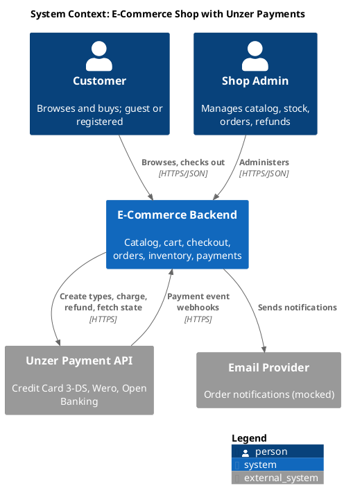
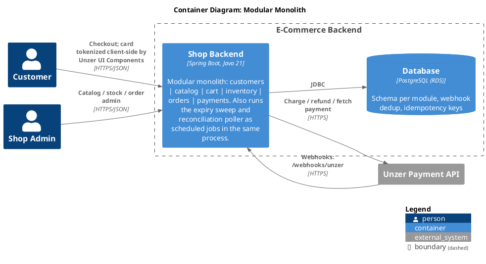
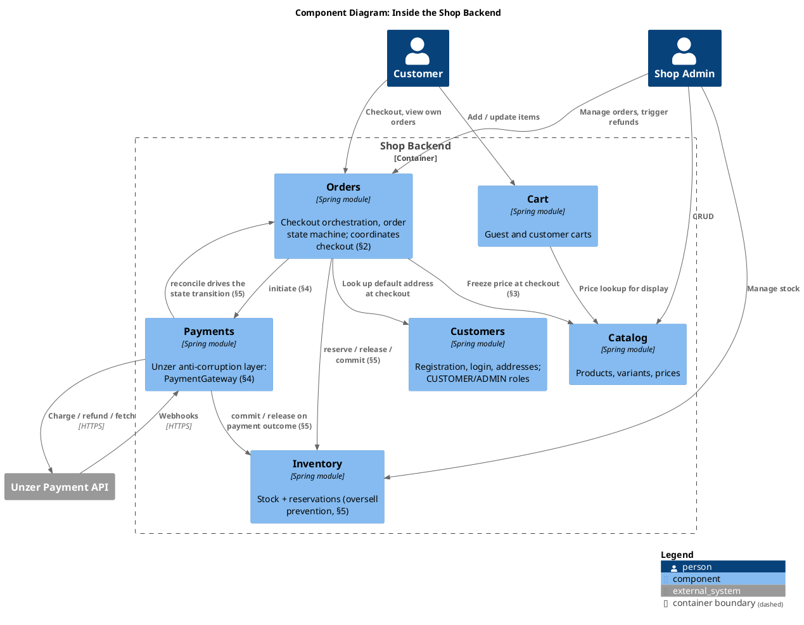
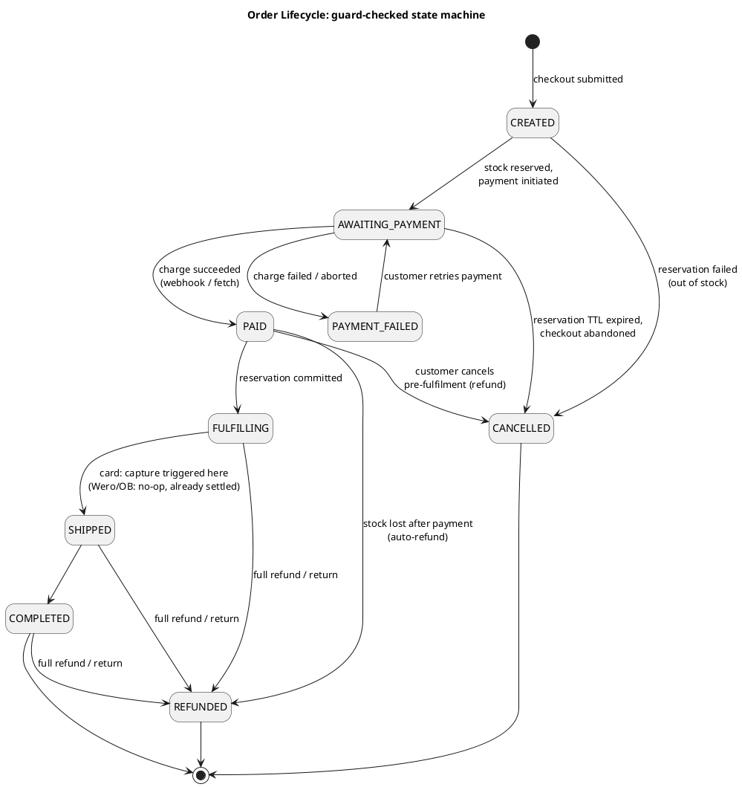
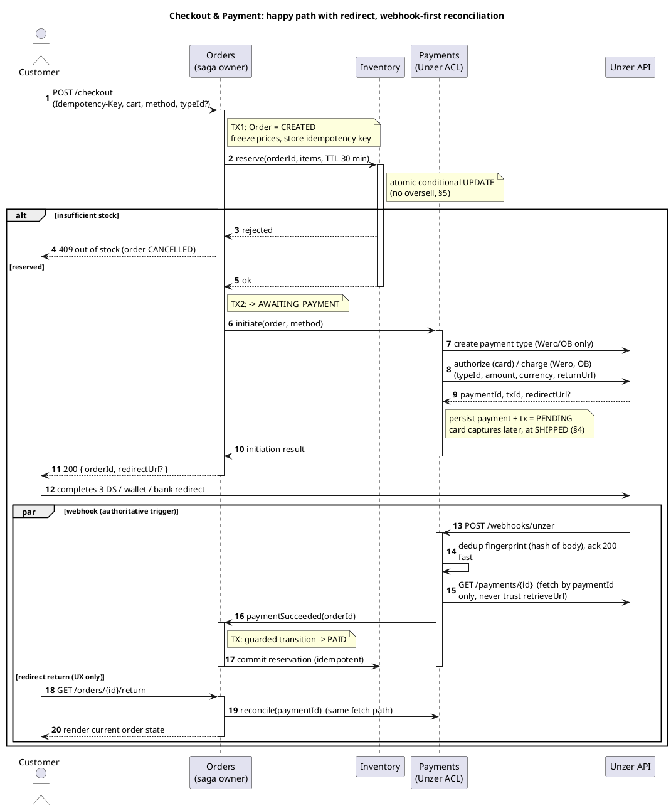
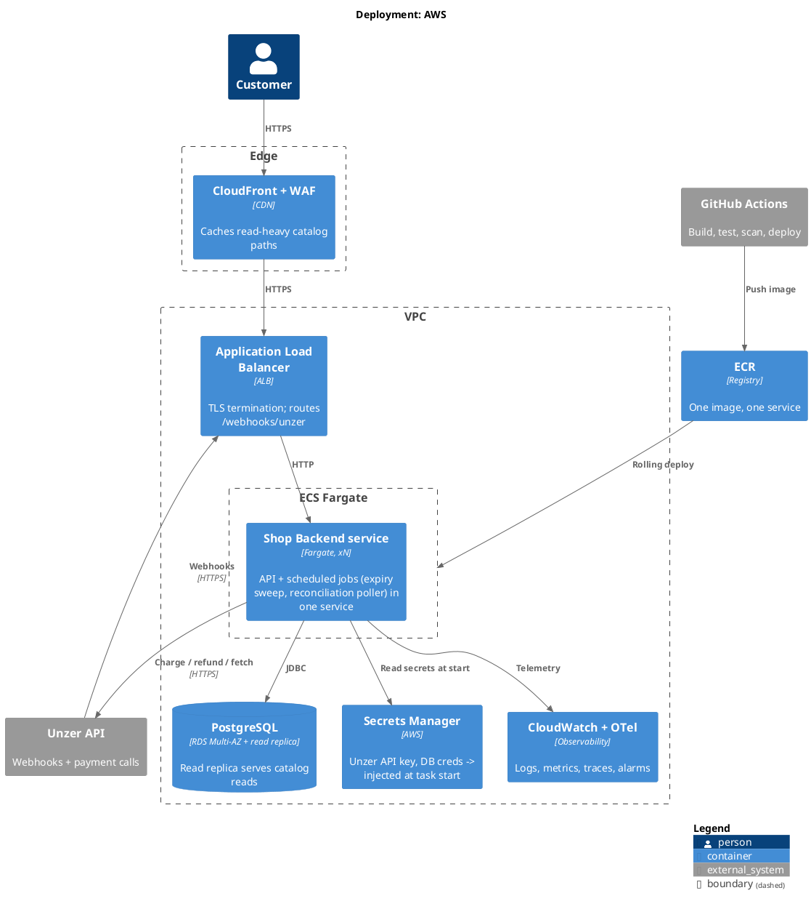

# E-Commerce Shop with Unzer Payments: Architecture Document

## 1. Overview & Assumptions

This document describes the architecture of a full e-commerce backend. It covers customers, catalog, inventory, cart, and checkout/orders, using the Unzer API for payments (Credit Card with 3-DS, Wero, and Open Banking). The code that comes with this document implements one part in full depth: checkout → payment → order confirmation, tested against the Unzer sandbox. This includes the webhook receiver and the consistency mechanism explained in §5.

**Assumptions.** One shop, one currency (EUR), one warehouse. The products are physical goods. Shipping exists as a concept, but the carrier integration is mocked. The scale is moderate: about 100k catalog reads per day and 1k orders per day, with room to grow. This is sandbox only, with no real money and no real card data. **What's real in the code:** checkout, the order state machine, stock reservation, Unzer Credit Card + Wero integration, the webhook receiver, and reconciliation. **What's mocked or stubbed:** customer registration and login (designed below and in §8, not built in the code slice), the Open Banking handler (designed, but stubbed behind the same interface), fulfilment/shipping, email notifications, and the admin UI.

## 2. System Decomposition

I chose a **modular monolith**: one Spring Boot application made of six modules with clear internal boundaries: `customers`, `catalog`, `inventory`, `cart`, `orders`, `payments`. Why: at checkout, these domains work closely together. One order touches four of them in a single user action. The team size and traffic don't justify splitting into separate services yet. A distributed system would also add more of the exact failure modes a payment-carrying system needs to control, not fewer. I keep the monolith's internal boundaries strict, so that splitting a module into its own service later stays a simple, mechanical change:

- Modules only talk to each other through Java interfaces: one module calls another module's service class directly, and never reaches into its database tables. For example: `payments` exposes `PaymentGateway.initiate/reconcile` (§4); `inventory` exposes `InventoryPort.reserve/release/commit`. Every module follows the same shape: one small, well-defined entry point in, and nothing internal leaking through. If a module is ever pulled out into its own deployed service later, some of these direct calls would need to change to a different mechanism instead, since a direct call stops being possible once there's a real process boundary in between (§9 covers what that would look like). That's a deliberate future step, not something built ahead of the need, because right now every module lives in the same process, and a direct call is simpler and just as correct.
- Each module owns its own PostgreSQL schema. **No foreign keys cross module boundaries**: one module refers to another only by ID.
- How I drew the boundaries: I looked at *why* and *how often* each part of the system changes, and who owns the data. Catalog changes for merchandising reasons. Inventory changes for operational reasons. Payments changes for compliance and provider reasons. Wherever these reasons differed, I put a boundary there.

`orders` is the module that coordinates checkout. Checkout is a multi-step process managed by the order state machine (§5), because a payment flow that sends the customer to another page and back needs one clear place that always knows "where are we, and what happens next?" There is one planned exception to the "never reach into another module's tables" rule: reserving stock and creating the order (§4, steps 1–5) both run as one local, all-or-nothing database transaction, in the same Postgres database, done directly within the request. This is simpler and safer than a multi-step async process, because it really is just one database. (§5 explains what keeps checkout safe once Unzer, a real external system, gets involved, without needing extra infrastructure to do it.)

**Sync vs. async, and why.** Anything the customer is actively waiting for stays synchronous: a normal request that waits for a reply. This includes browsing, cart changes, submitting checkout, the reserve-and-create-order step (fast, local), and the first call to Unzer to start a payment (external, but the customer needs the redirect link or an error message right away, so there's no good way to make this step async). Everything after that point runs in the background instead: handling Unzer's webhook when it arrives, and two scheduled jobs, one that checks for expired reservations, one that re-checks payments stuck waiting on Unzer. This split is not random. Two things decide it: whether Unzer eventually approves a payment, and, for expired reservations, the simple passing of time. Both are slow, external, or disconnected from the original request. Making the customer's checkout wait on those would tie checkout speed to a system I don't control and can't guarantee is always up. All of this, today, runs inside the same process as the API itself; see §7 for why a separate worker process isn't justified yet.





One level deeper, inside that single "Shop Backend" container, are the six modules from the bullets above. This is the same decomposition, just drawn instead of described:



`orders` and `payments` are the only two components with an arrow pointing back into another module (`payments → orders`, `payments → inventory`) rather than only ever being called. That two-way relationship is exactly the "orders is the coordinator, but payments is the trigger that resolves the wait" idea from §2 and §5, drawn instead of just argued for.

## 3. Domain & Data Model

**Database: PostgreSQL** (one RDS instance, one schema per module). I chose Postgres because the two hardest problems here (never overselling stock, and never losing or duplicating a payment) are exactly what database transactions, row locking, and unique constraints are built to solve. JSONB handles flexible product attributes. Postgres's built-in full-text search is enough for now (OpenSearch would be a later upgrade, fed by catalog events). Using one physical database, split into schemas, is the cheapest option to run today, and keeping the schemas separate means I can split out real, separate databases later if a module needs its own.

Key entities (owner module in brackets):

- **[customers]** `customer(id, email, password_hash, role, created_at)`, with roles `CUSTOMER` or `ADMIN`; `address(id, customer_id, label [BILLING|SHIPPING], line1, line2, city, postal_code, country, is_default)`, since a customer needs more than one address and checkout needs a clear default to pre-fill. `email` is unique, since it's both the login identifier and how a later registration gets matched to past guest orders. Passwords are hashed with bcrypt, never stored or logged in any reversible form. Registration returns a token pair immediately on success, the same as a normal login, rather than making the customer log in again right after signing up; a duplicate email is rejected with a clear conflict response instead of silently overwriting anything. A guest checkout creates an order with the contact details saved directly on it, with no account needed. If a guest later registers using the same email, past guest orders get linked to the new account by that email match at registration time, rather than asking the customer to somehow prove they were the same person.
- **[catalog]** `product(id, name, description jsonb, category_id)`, `variant(id, product_id, sku unique, attributes jsonb, price_minor bigint, currency char(3))`, `category(id, name, slug)` as a flat list, not a tree; a real hierarchy is a reasonable next step, not something this scale needs yet. Browsing paginates on `variant`, filtered by `category_id` and price range, backed by the indexes below. Admin CRUD on `product`/`variant` is a soft delete, not a hard one: `inventory.reservation` and `payments.payment_transaction` rows from old orders can still reference a `variant_id` long after a product is discontinued, so removing one flips a status flag rather than deleting the row, keeping that history intact. **Money is always stored as a whole number in the smallest unit (like cents) plus a currency code**, never as a floating-point number.
- **[inventory]** `stock(variant_id pk, on_hand int, reserved int)`, `reservation(id, order_id, variant_id, qty, expires_at, status)`. The reservation logic always keeps `reserved` at or below `on_hand`. When an order moves from `PAID` to `FULFILLING`, the reservation turns into a real deduction: `on_hand -= qty` and `reserved -= qty`, both in one statement, in the same transaction as the order's status change. When a reservation is released instead (it expired, or payment failed), only `reserved -= qty` happens.
- **[cart]** `cart(id, customer_id nullable, token)` for guests, `cart_item(cart_id, variant_id, qty)`. The cart does not store prices or availability. Both are looked up fresh from `catalog` and `inventory.stock` (`on_hand - reserved`) each time the cart is shown, never cached on the cart row itself. This is a display-only check, not a hold: the cart never reserves stock, only checkout does (§5), so what the cart showed as available a minute ago can still be gone by the time checkout actually runs. That's not a bug to route around, it converges on the same out-of-stock path checkout already has (§4's sequence diagram), just reached one step later than the cart's display suggested. Prices only get locked in once checkout creates the order.
- **[orders]** `order(id, customer_ref, status, total_minor, currency, version)`, `order_item(order_id, variant_id, sku, name, unit_price_minor, qty)`, a snapshot of the price and name at the time of purchase, which never changes after the order is created; `order_status_history(order_id, from, to, cause, occurred_at)`, which keeps a full record of every status change for auditing.
- **[payments]** `payment(id, order_id, method, status, unzer_payment_id, unzer_type_id, amount_minor, currency)`, `payment_transaction(id, payment_id, kind [CHARGE|AUTHORIZE|REFUND], unzer_tx_id, status)`, `refund(id, payment_id, amount_minor, reason, unzer_tx_id, created_at)`. These tables connect my own data model to Unzer's: one order maps to one payment, which maps to one Unzer `paymentId`, which can have many transactions under it, including zero or more partial refunds. A refund is only valid if the sum of every refund already recorded for that payment, plus the new one, doesn't exceed the original `amount_minor`, checked in code against the existing rows rather than enforced as a database constraint, since it depends on a running sum.
- **[cross-cutting]** `processed_webhook(unzer_event_fingerprint unique, processed_at)`, which stops the same webhook being processed twice; `idempotency_key(key unique, order_id, response_hash)`, which stops the same checkout request being processed twice.

Indexes match how the data is actually queried: `variant(sku)`, `order(customer_ref, created_at)`, a unique index on `payment(unzer_payment_id)`, a partial index on `reservation(expires_at) where status='ACTIVE'` for the expiry check, and a GIN index for text search.

**Order lifecycle.** Every status change is checked by the state machine. A change that isn't allowed is rejected. Repeating the same change twice does nothing the second time. This is exactly what makes a duplicate webhook harmless:



A **partial** refund never appears as a transition here: it doesn't touch the order's overall status at all, only the running total on the `refund` table (§3). Only a refund that brings that total up to the full payment amount moves the order to `REFUNDED`, and that can happen from `FULFILLING`, `SHIPPED`, or `COMPLETED`, not only `PAID`. A customer can return an order that's already been delivered just as easily as one still being packed.

## 4. Checkout & Payment Flow

The `payments` module is a protective wrapper around Unzer. The rest of the system never talks to Unzer directly. My code talks to one `PaymentGateway` interface. Each payment method (`CardHandler`, `WeroHandler`, `OpenBankingHandler`) implements the same two things: `initiate(order, paymentInput) → PaymentInitiation(redirectUrl?)` to start a payment, and one shared `reconcile(paymentId)` path to check its result. Adding a fourth payment method means writing one new handler class and registering it. Nothing in the orders module needs to change. All three methods follow the same basic pattern Unzer uses: create a resource, run a transaction, then get a webhook. Card is a little different: the card details themselves are turned into a `typeId` token in the browser, by Unzer's own UI code. My backend never sees the raw card number. And the 3-DS security check is, from my code's point of view, just another redirect and comeback. **Credit Card is authorized at checkout, and captured (actually charged) at shipment.** This means the money is reserved but not taken until the order actually ships, so I never hold a customer's money for something I haven't sent yet, and cancelling before shipment is a simple, clean cancellation rather than a refund. **Wero and Open Banking take the money immediately** (a charge, with no separate authorize step). This is a rule from Unzer, not a choice I made. My `PaymentMethodHandler` interface handles both cases the same way, by having a separate `capture` step (`handler.capture(paymentId)`) that does nothing for methods that already took the money. This capture step runs automatically when an order moves from `FULFILLING` to `SHIPPED`.

The most important rule here: **the redirect back to my site is just a UI hint, and the webhook is just a signal to go check. Neither one is trusted as the real answer on its own.** Both of them lead to the same single action: *fetch the real payment status from the Unzer API, and update the order based on that.* Since that action gives the same correct result no matter how many times it runs, it doesn't matter which one happens first, the redirect or the webhook.

**Refunds, full or partial, are always an explicit request, never inferred.** A caller (an admin action today; a customer-initiated return once that exists) asks for an amount against a specific payment. The system never guesses that a customer wants their money back. What that request actually does depends on whether the money has moved yet. If the payment is still just `AUTHORIZED` (card, before shipment), there's nothing to refund yet: cancelling is a full void of the authorization, since there's no way to partially void money that was never taken. Once the payment is `PAID` (card after capture, or Wero/Open Banking from the moment they charge), a real refund call goes to Unzer for the requested amount, which can be less than the total. Either way, the request is checked first against the sum of any refunds already recorded for that payment (§3), so refunding more than was actually charged is impossible by construction. If the new refund brings the running total up to the full amount, the order moves to `REFUNDED`; if it doesn't, the order's status is untouched and the refund is just another row in the audit trail. Refund requests carry the same `Idempotency-Key` mechanism as checkout (§5), so a retried request can't double-refund.



## 5. Consistency & Failure Handling

**Avoiding overselling.** A stock reservation is a single all-or-nothing database statement:

```sql
UPDATE inventory.stock SET reserved = reserved + :qty
WHERE variant_id = :v AND on_hand - reserved >= :qty;
```

When two buyers try to grab the last unit of stock at the same time, the database's row lock forces them into a queue. Only one of the two matching statements actually finds enough stock; the other one updates zero rows, and that checkout gets rejected. There's no gap between reading the stock level and writing the new one, and no extra locking needed in the application code. The trade-off: for a very popular item, everyone buying it has to wait their turn on that one row. That's fine at this scale. The alternatives are worse: retrying with version checks causes a storm of retries under heavy load, and Redis counters would give up the exact database guarantees I need here. If flash sales become a real need, the fix would be to split a hot item's stock count across multiple rows. Reservations that are never paid for are cleaned up by a background job that scans for expired, still-active reservations: it frees up the reserved stock, and if the order is still `AWAITING_PAYMENT` past its time limit, it cancels the order too.

**Keeping payment state and order state in sync, without extra infrastructure.** Reserving stock and creating the order (§2, §4, steps 1–5) is just two local database transactions, run one after another, in the request itself. If it fails (out of stock), there's nothing to undo, since nothing was ever committed. From `AWAITING_PAYMENT` onward, the other side is Unzer: an external system that is slow and can fail on its own, separately from my database. That's a real boundary, and it needs real care, but the care comes from two properties, not from extra messaging infrastructure between services. Every state change is still a local, all-or-nothing transaction, and `reconcile()` (§4) is idempotent, meaning the webhook, the redirect return, and the reconciliation poller can all call it, in any order, any number of times, and land on the same correct result. A duplicate trigger is either dropped outright (the fingerprint check) or simply does nothing (the state machine ignores a transition it's already made). This is exactly what turns the classic failure case (*the payment succeeded at Unzer, but saving that fact to my database failed*) into something recoverable instead of something that loses data (explained in detail below). When something does go wrong, I undo it with a compensating action instead of a fancy distributed transaction: if payment fails, release the reservation; if an order is cancelled after payment, refund it through Unzer (§4 covers full vs. partial, and how the amount is checked). That kind of infrastructure would only earn its place here the moment payments and orders became genuinely separate deployed services that could no longer call each other directly; §9 covers what that would involve and why it isn't built yet. As long as they're one process, the idempotency and the guard-checked state machine are already doing that job.

**Several layers stop duplicate actions.** (1) `POST /checkout` takes an `Idempotency-Key`, and the database column for that key has a **unique constraint**. If two identical requests arrive at the same time, only one insert succeeds. The other one fails on that constraint and simply returns the same order instead of creating a second one, before the request ever reaches Unzer at all. (2) `payment.order_id` has its own unique constraint, so even if two requests somehow both got past the idempotency check, only one of them could ever insert a payment row for that order. (3) Webhooks are fingerprinted and checked against `processed_webhook`, so the same webhook is never processed twice. (4) The state machine simply does nothing if asked to repeat a transition it's already made. Put together: no double charge, no double shipment, and no overselling, even under retries.

**Concrete failure walkthroughs.**

- *The payment succeeds at Unzer, but saving that to the order fails* (a crash, a deploy, a database hiccup): the payment itself is never lost. Unzer keeps re-sending the webhook until it's confirmed as handled, and separately, a background job keeps re-checking Unzer's records and re-applying the update. Both paths call the same `reconcile()` function (§4), so the order still ends up `PAID` even if the very first attempt to save that didn't work.
- *The webhook arrives before the customer is redirected back:* this is fine, by design. The webhook already fetched the status and moved the order to `PAID`. When the redirect handler runs afterward, it just checks again, finds nothing has changed, does nothing, and shows the customer "paid".
- *Unzer times out in the middle of a charge, and I don't know if it worked:* the payment just stays `PENDING`. I never guess and retry the charge blindly. Instead, a background job checks Unzer directly using the `paymentId`/`orderId`: if the charge actually went through on Unzer's side, the order moves to `PAID`; if no charge exists there at all, the payment is marked failed, the reservation is released, and the customer can try again.
- *The reservation expires, and then the payment succeeds anyway* (a slow 3-DS check, for example): once the order is marked `PAID`, the order module tries to **reserve the stock again**. If the stock is still there, everything continues as normal. If it's gone, the system automatically refunds the customer in full through the payments module, and the order becomes `REFUNDED`. The customer is never left having paid for something that can't actually be shipped.

## 6. Technology Choices (Java)

Spring Boot 3 on Java 21. Spring Modulith to actually enforce the module boundaries described above, not just document them as an intention. Spring Data JPA for most database access, but plain, precise SQL for the one place it really matters: the stock reservation update. Flyway for database migrations. Spring Security for JWT-based login, with `CUSTOMER` and `ADMIN` roles. I did *not* use Spring StateMachine. A small, hand-written table of allowed transitions is simpler and easier to fully test. I used the **official Unzer Java SDK** for talking to Unzer, since it already correctly handles their create-then-transact pattern and authentication; I only use raw HTTP calls where the SDK doesn't yet support something. For tests, I used Testcontainers, including a concurrency test that proves stock can never be oversold.

Representative code: the reservation and the single reconciliation path all triggers converge on:

```java
@Transactional
public boolean reserve(UUID orderId, UUID variantId, int qty, Duration ttl) {
    int updated = jdbc.update("""
            UPDATE inventory.stock SET reserved = reserved + ?
            WHERE variant_id = ? AND on_hand - reserved >= ?""", qty, variantId, qty);
    if (updated == 0) return false;                     // lost the race: no oversell

    Reservation r = new Reservation();
    r.setOrderId(orderId);
    r.setVariantId(variantId);
    r.setQty(qty);
    r.setExpiresAt(Instant.now().plus(ttl));
    r.setStatus(ReservationStatus.ACTIVE);
    reservationRepository.save(r);                       // same TX: stock + reservation atomic
    return true;
}

@Transactional  // called by webhook, redirect return, and reconciliation poller
public ReconcileOutcome reconcile(String unzerPaymentId) {
    Payment payment = paymentRepository.lockByUnzerPaymentId(unzerPaymentId)
            .orElseThrow(() -> new IllegalStateException("Unknown paymentId: " + unzerPaymentId));

    var remote = unzer.fetchPayment(unzerPaymentId);                    // authoritative state
    var target = mapState(remote.getPaymentState().name(), payment.getStatus());

    if (target == payment.getStatus()) {
        return new ReconcileOutcome(payment.getOrderId(), target, false); // idempotent no-op
    }

    payment.setStatus(target);                            // guard-checked
    paymentRepository.save(payment);                       // same TX
    applyOrderSideEffects(payment.getOrderId(), target);   // direct call to orders + inventory
    return new ReconcileOutcome(payment.getOrderId(), target, true);
}
```

## 7. Deployment & DevOps (AWS)



There's one ECS Fargate service, running the API and the two scheduled jobs (the reservation-expiry sweep and the reconciliation poller) together in the same process. I looked at splitting these into a separate worker service, the way a diagram like this often does, and decided against it: both jobs are lightweight scheduled queries against Postgres, neither competes with checkout traffic for resources, and neither has a scaling need independent of the API. Splitting them would add a second service to deploy and monitor for no corresponding benefit today; see §9 for when that would change. **The read-heavy side (catalog browsing)** scales using CloudFront caching, a read replica of the database, and an application-level cache, none of which affects checkout. **The write-heavy side (checkout)** scales the service based on how many requests the load balancer is seeing; the real limit here, eventually, is how much write traffic Postgres can handle, and at that point `inventory` and `orders` would be the first modules I'd split into their own services (the schema boundaries are already there, ready for that). **Secrets:** the Unzer API key only ever lives in Secrets Manager, and is loaded when a task starts. It's never in the code repository or the container image, so the real key can be added later, whenever it's available, with a single secret update. **CI/CD:** GitHub Actions runs unit tests and Testcontainers integration tests, scans the image, pushes it to ECR, and does a rolling deploy to ECS with health checks. Flyway runs its migrations on startup (and migrations are always written to be backward-compatible). **Observability:** logs are structured JSON, tagged with `orderId`/`paymentId` so they can be traced together; OTel traces follow a request through the whole checkout flow; and there are alarms for: webhooks taking too long to process, payments stuck in `PENDING` for over 15 minutes, and failures in the reservation-expiry job. Each of these alarms maps directly to one of the failure cases in §5. The `order_status_history` and `payment_transaction` tables together give a full audit trail of what happened and when.

## 8. Security & Compliance

Login checks the submitted password against the stored bcrypt hash; on failure, the error is the same generic message whether the email doesn't exist or the password is wrong, so a login attempt can't be used to discover which emails are registered. Login attempts are rate-limited per IP and per email, the same style of defense as the card-testing limits below, since credential stuffing targets this endpoint specifically. Login uses short-lived JWT access tokens plus a longer-lived refresh token, so a stolen access token has a small blast radius even if it's never explicitly revoked. `CUSTOMER` and `ADMIN` roles are checked at the API level, in every module, and a customer's own requests are also checked for ownership, not just role: fetching an order confirms the order's `customer_ref` matches the token's subject, so a valid customer token can't be used to browse someone else's order just by guessing its id. Guests can check out too, using an unauthenticated cart token that's tied to their order instead of an account. **Card data:** Unzer's UI Components turn card details into a token right in the browser, so my backend only ever sees a `typeId`, never the real card number. This keeps me out of most PCI scope. I only need to meet the lighter SAQ-A requirements (always use TLS, never log card data, keep the payment page itself secure). **The webhook endpoint** has its own dedicated URL. Unzer's webhooks don't actually include a signature to verify. I checked their real documentation and confirmed this (an earlier draft of this document wrongly said there was a signature to check). So the real protection, which matches Unzer's own security advice, is: never trust the event name by itself, and never trust the `retrieveUrl` in the webhook body, since a fake webhook could point that anywhere. Instead, every trigger (whether it's the webhook, the redirect, or the background check) re-fetches the payment status using only the `paymentId`, through my own pre-configured connection to Unzer. That way, a fake webhook can't cause any harm, no matter what it claims. On top of that, a fingerprint check avoids re-checking the same webhook twice when it's legitimately re-sent. **Defending against card testing:** checkout and payment endpoints have their own rate limits: capped attempts per IP and per session, with extra friction after repeated failures. This matters because a bot testing stolen card numbers will hit exactly these endpoints, so they need tighter limits than normal login rate-limiting. **Secrets** live in Secrets Manager, accessed through IAM roles with the least access needed, never in a config file or in git history. Standard practices apply too: validating all input at the edge, only ever using parameterized SQL, and keeping a full audit trail through the status-history tables. **A GDPR note:** the audit trail is append-only, for traceability, which is in some tension with a customer's right to be forgotten. I resolve this with a retention window and anonymization: old records have personal details stripped out, while the basic history of status changes is kept, rather than deleting the records outright.

## 9. Trade-offs & Next Steps

**What I chose, and what it costs me.** A modular monolith instead of microservices: simpler to run today, and still easy to split apart later. The cost is that everything shares one blast radius and one database's limits. ECS Fargate over EKS: no service mesh or multi-service orchestration need here, so Kubernetes would be operational overhead without a corresponding benefit; the cost is real migration work if this ever needs to join a Kubernetes fleet later. Row locking for reservations instead of optimistic locking or Redis: correctness comes first. The cost is that a very popular item forces buyers to queue on that one row. A single local transaction for reserve-and-create, and from `AWAITING_PAYMENT` onward, correctness comes from an idempotent `reconcile()` and a guard-checked state machine rather than a saga: the cost is that this reasoning has to be understood, not just the mechanism itself, since it's less obviously "one uniform pattern" than a textbook saga diagram would be. Direct, in-process calls instead of an outbox and a message queue: the two background jobs are lightweight enough not to need one yet; the cost is that this choice has to be revisited, not just scaled up, the moment any module becomes a genuinely separate deployed service. Authorize-then-capture for card, instead of charging immediately: this avoids holding a customer's money before shipping. The cost is that Wero and Open Banking still have to charge immediately regardless, since Unzer doesn't support authorize for them. Always re-fetching from Unzer on a webhook, using only the `paymentId` rather than trusting the webhook's own `retrieveUrl`: the cost is one extra API call per event, but it buys a real, trustworthy result and protection against fake webhooks, without needing a signature that Unzer doesn't actually provide.

**Left out, and what I'd do next.** The Open Banking handler is stubbed, though designed to fit the same interface. There's no promotions or tax engine yet. Search stays inside Postgres until the catalog grows large enough to need OpenSearch. Only one currency is supported for now. Refunds are amount-based against the whole payment, not allocated to specific line items: a customer returning one item out of three gets a partial-amount refund recorded once, not a system that knows which item's stock or price it corresponds to; real per-item returns, with restocking, would be a natural next step. Given more time, I would add: an event-sourced ledger for payments, automated tests that simulate the failure cases from §5 on purpose, canary deployments, and a proper scheduled job to handle the GDPR anonymization described in §8. The one I'd call out specifically: splitting `inventory` out into its own real service once write traffic demands it, and building the outbox table and message queue *at that point*, not before, since that's exactly the moment a direct method call stops being possible and something durable has to cross the new gap instead.